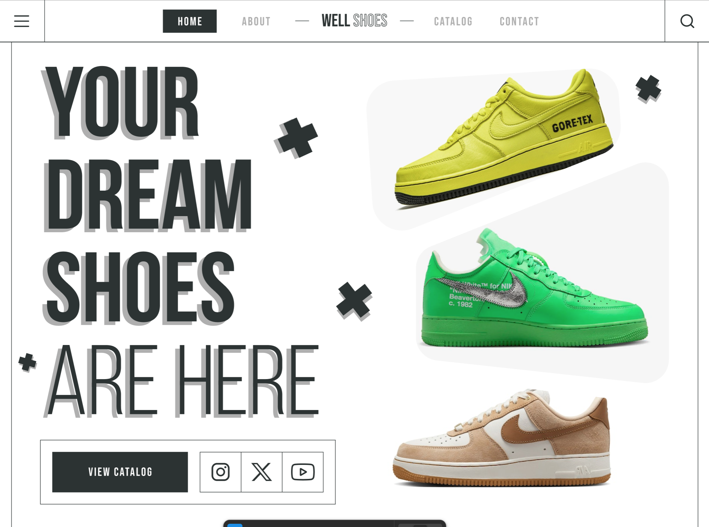

# 👟 Well Shoes — Your Dream Shoes Are Here

Well Shoes is a modern e-commerce product showcase website designed to highlight footwear through clean aesthetics, fast performance, and a smooth shopping experience. The project focuses on presenting product features in a visually compelling way while maintaining a scalable and developer-friendly architecture.

---

<h3>🖼 Preview</h3>

---

<h3>🎯 Project Goals</h3>

- ✅ Build an immersive and dynamic music streaming interface using React
- ⚡ Deliver smooth and responsive UI with SCSS modules
- 🧠 Ensure clean, maintainable, and scalable code through TypeScript
- 🚀 Optimize performance with Vite for fast build and development speed

---

<h3>🧩 Development Features</h3>

- ⚛️ React Components Architecture — modular and reusable design
- 🧠 TypeScript — strict typing and maintainable logic
- 🎨 SCSS — styling approach for flexibility and control
- 🌗 Adaptive UI — responsive and theme-friendly layout
- ⚙️ Vite — lightning-fast development environment and optimized builds

---

<h3>🛠️ Tech Stack</h3>

| Technology             | Purpose.                              |
| ---------------------- | ------------------------------------- |
| **React**              | Component-based UI architecture       |
| **TypeScript**         | Type safety & clean logic structure   |
| **SCSS**               | Styling and layout flexibility        |
| **Vite**               | Fast build tool and dev server        |
| **HTML5 / CSS3**       | Core structure and responsive design. |

---

✨ The chosen **technology stack** ensures stable performance, ease of development, and long-term support.
